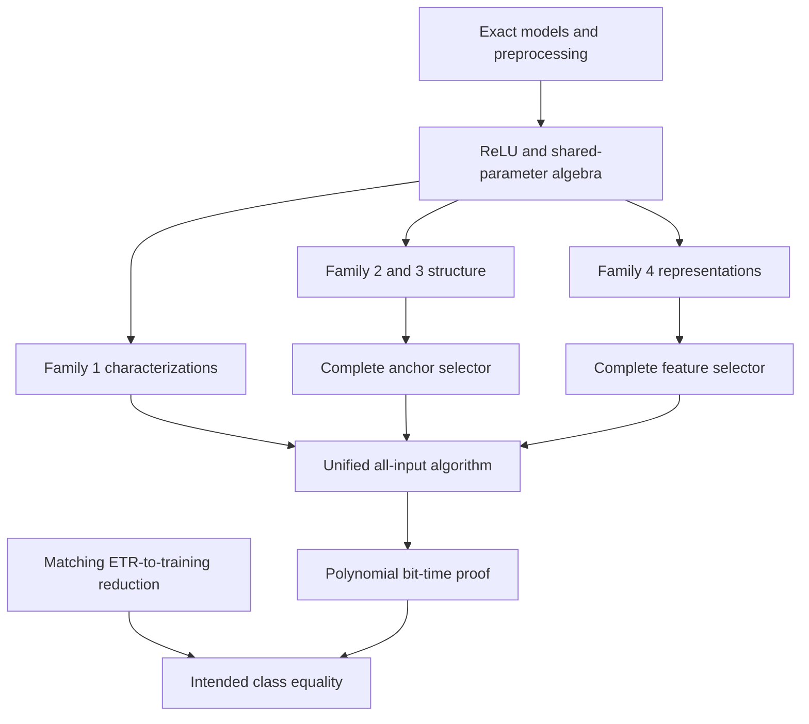

# Manuscript plan and verification boundary

The page ranges are the original writing plan. This repository is a formalization
companion, not a claim that the complete 91–153-page manuscript or final proof
already exists. All four families remain in scope.

| Part | Planned pages | Work in this repository | Remaining dependency |
|---|---:|---|---|
| 1. Introduction and main results | 4–6 | Exact theorem scope, dependency map, source provenance | Final abstract must follow the complete proof chain |
| 2. Exact Neural Network Training | 5–7 | Rational data, real parameters, supplied widths, preprocessing semantics | Binary encoding, full decision/construction interface |
| 3. Structural principles of neural networks | 6–9 | ReLU identities, normalization, zero padding, permutations, shared expression composition | Broader graph model and its size/cost semantics |
| 4. Four-family representation theorem | 8–14 | Exact family predicates, partial embeddings, coupled interface theorem | O6 broader coverage; O2/O4 complete bounded representations |
| 5. Mathematical analysis of the four families | 18–26 | Family 1 characterization; Family 2/3 structural lemmas; Family 4 complementarity equivalence | O1–O5; minimum width, full flow/anchor proofs, finite bounds, selectors |
| 6. Unified exact-training algorithm | 10–16 | Certificate soundness and partial-outcome composition; source implementation correspondence | O7 verified all-input algorithm |
| 7. Time and space analysis | 7–11 | Arithmetic/bit distinctions and explicit accounting below | O3/O5/O7 global bounds and encoded witness bounds |
| 8. Complexity-class consequence | 5–9 | Exact required reduction direction and final dependency in O8 | Standard formal classes/encodings, matching ETR reduction, complete polynomial algorithm |
| Main text subtotal | 63–98 | Planning estimate | No padding to meet it |
| References | 3–5 | Pinned primary formalization sources and original research inventory | Verify further literature only when used |
| Appendices | 25–50 | Inventory, benchmark provenance, derivations, interfaces, build/audit record, theorem correspondence | Remaining algorithm, arithmetic and proof records |
| Complete manuscript | 91–153 | Original total retained | Completeness determines final length |

## Dependency map

Edges represent dependencies, not a claim that every node is proved. The exact
status of every formalized declaration is in the theorem table and kernel logs.
O6 is additionally required if the source problem includes a wider graph class.

## Algorithm correspondence and contracts

The recovered source entry point is `joint_fit(xs, ys, width, family=None,
state_budget=5000000)`. Its output may be YES, NO, or UNRESOLVED.
`one_hidden_vector` selects the shared one-feature vector case; `same_direction`
means right-facing. An unspecified common direction requires both reflections.
The newer bounded representation builders are not complete selector implementations.

| Source routine | Mathematical contract linked here | Scope of formal verification |
|---|---|---|
| `prepare` | Inconsistent duplicates cannot fit; consistent resampling preserves fitting | Semantic preprocessing lemmas; Python implementation not verified |
| `one_hidden_relu` | Extremal-bias two-affine-system equivalence | Scalar characterization; no LP runtime bound |
| `one_hidden_vector_output` | Collinearity plus a scalar coordinate, one shared feature | Characterization and lift; API empty-data handling remains separate |
| `right_facing_minimum` | Run pairing and reconstruction | Pair/reflection/helper components; full minimum-width proof remains O1 |
| `GroupFlow` | Group representation, prescribed deletion factors | Gram-kernel and merging components; complete representation remains O2 |
| `AnchorForm` | Integral critical-width anchor system | Binary product components and abstract helper uniqueness; O2/O3 remain |
| `fixed_count_modular` | Count-specific residue equality with strict range bound | Range and residue correctness; no DP implementation/bit-complexity proof |
| `SharedParameterForm` | Bounded shared-feature system | Normalization, complementarity, big-M component equivalences; O4/O5 remain |
| `verify_lp` and `verify_certificate` | Exact points or exact linear consequences | Infeasibility-certificate algebra; source checkers not translated |
| `joint_fit` and retained stages | First sound resolved result, otherwise unresolved | Abstract partial-outcome composition only; O7 remains |

## Time and space accounting

Let L be total binary input length, including rational numerators/denominators and
binary width. Arithmetic work counts exact operations; bit work also counts their
operand lengths. The semantic real-valued Lean functions are noncomputable and
are not presented as executable real-arithmetic algorithms.

For the intended implementation, account for
Tpre + Trep + sum over actual calls Tcall(input_k) + Trecon + Tcheck.
Bound the number of calls, every generated input size and operand length, the
complete selection work, and output encoding. Space counts simultaneously live
inputs, states, solver workspace, histories and witnesses. A cap on partial-run
resources does not prove completeness.

The source's O(m) post-sort arithmetic count for Family 2 must not be transferred
to arbitrary-width multidimensional training or interpreted as O(L) bit time.
The modular O(n(k+1)q) term retains its dependence on numerical q. No polynomial
bit-time theorem is claimed for the unified algorithm by this repository.

## Appendix coverage

1. Source/version inventory: `provenance/source-inventory.json` and implementation inventory.
2. Historical benchmark: `provenance/historical-benchmark.json`, unchanged 757 denominator.
3. Supporting derivations: `mathematics.md`, M01–M11.
4. Algorithm interfaces: this correspondence and `obligations.md`, O3/O5/O7.
5. Arithmetic/encoding/determinant details: explicit remaining O1/O4/O7; no unproved bounds assumed.
6. Lean project and actual build records: pinned manifest, `scripts/verify.py`, `verification/`.
7. Manuscript-to-Lean correspondence: this map, mathematics labels, and theorem table.
8. Assumption audit: every project theorem's `#print axioms`, plus explicit-hypothesis discussion.
